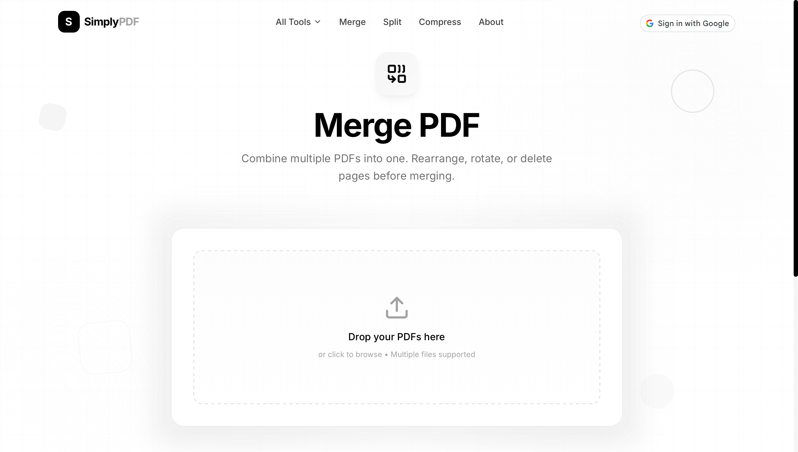

<div align="center">

# 📄 SimplyPDF

**The Ultimate Premium Suite for Your PDF Needs**

[](https://www.simplypdf.com)
[](https://github.com/ArshVermaGit)
[](LICENSE)

---

### **100% Free • Private • Lightning Fast**

SimplyPDF is a state-of-the-art web application designed to handle complex PDF tasks directly in your browser. With a focus on **Privacy-First Architecture**, your files never touch a server—everything is processed locally on your machine.

---

</div>

## 🖼️ Visual Experience

### **Modern, Premium, Aesthetic**
SimplyPDF isn't just a tool; it's a premium experience. Featuring **Animated Backgrounds**, **Floating 3D Decorations**, and **Smooth Framer Motion Transitions**, we've brought high-end design to document management.

<div align="center">

| 🏠 Landing Page | 🖼️ PDF to JPG |
| :---: | :---: |
|  |  |

| 🔍 Features | 🎨 Design & Interactivity |
| :---: | :---: |
|  |  |

</div>

---

## � Features at a Glance

SimplyPDF packs **16+ powerful tools** into one seamless interface.

- **🔄 Conversions**: Word ↔️ PDF, Excel ↔️ PDF, JPG ↔️ PDF
- **🔍 Intelligent OCR**: Extract text from scanned documents using industry-leading AI.
- **🔐 Security**: Password-protect your files or remove restrictions with a click.
- **✍️ Editing**: Add text, shapes, digital signatures, and watermarks.
- **⚡ Optimization**: Compress file sizes without losing quality.
- **📂 Organization**: Merge, Split, Rotate, and Reorder pages intuitively.

---

## 🛠️ Tech Stack

Built with a modern, high-performance stack for a seamless user experience.

- **Frontend**: [Next.js 14+](https://nextjs.org/) (App Router)
- **Styling**: [Tailwind CSS](https://tailwindcss.com/)
- **Animations**: [Framer Motion](https://www.framer.com/motion/)
- **Core Processing**: `pdf-lib`, `pdfjs-dist`, `tesseract.js`
- **Data Export**: `docx` (Word), `xlsx` (Excel)

---

## � Privacy Architecture

SimplyPDF treats your privacy as the #1 feature.

- **Local Processing**: All file manipulations occur in your browser's RAM.
- **No Cloud Storage**: We do not have a backend that stores your documents.
- **No Signup Required**: Start working immediately without giving away your personal info.

---

## 🚀 Getting Started

To run SimplyPDF locally:

1. **Clone the Repo**
   ```bash
   git clone https://github.com/ArshVermaGit/SimplyPDF.git
   ```
2. **Install Dependencies**
   ```bash
   cd SimplyPDF && npm install
   ```
3. **Launch Dev Server**
   ```bash
   npm run dev
   ```
   Open `http://localhost:3000` to start using SimplyPDF!

---

## 👨‍� Developed by Arsh Verma

I'm a Full-Stack Digital Creator and Tech Gaming Technology student at VIT Bhopal, passionate about blending technical precision with creative vision.

<div align="center">

[](https://arshcreates.vercel.app/)
[](https://www.linkedin.com/in/arshvermadev/)
[](https://x.com/TheArshVerma)
[](mailto:Arshverma.dev@gmail.com)

</div>

---

<div align="center">

**⭐ Loved SimplyPDF? Give it a Star on GitHub! ⭐**

Built with ❤️ by [Arsh Verma](https://github.com/ArshVermaGit)

</div>
